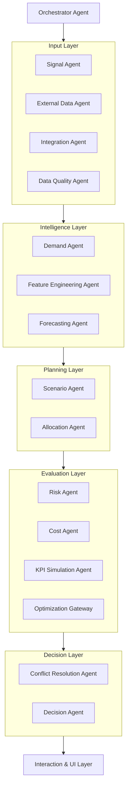

# Nike Copilot - Agentic UI & Logic Skills

This document captures the reusable patterns, schemas, and design systems established during the Nike Agentic AI POC. Use these as a blueprint for future high-fidelity agentic projects.

## 1. Multi-Agent Tracing Schema (Written Style)
To maintain a high-transparency "Human-in-the-Loop" experience, all agent logs MUST follow this schema.

### JSON Payload Structure
```json
{
  "node": "AgentName",
  "trace_payload": {
    "agent_name": "Demand Agent",
    "stage": "START | ACTION | OUTPUT | DECISION | ERROR",
    "timestamp": "2024-04-09T12:00:00Z",
    "decision": "Main textual action or outcome (e.g., 'Demand anomaly detected at Store 405')",
    "reason_summary": "Supporting mathematical logic (e.g., 'Z-Score 3.2 exceeds threshold of 2.0')",
    "tool_name": "ZScoreModule",
    "latency_ms": 120,
    "confidence": 0.95,
    "agent_type": "ML | Script | LLM"
  }
}
```

### UI Interaction Standards
- **Streaming Speed**: 10-15ms per character.
- **Sequential Animation**: Decision text types first, followed by the `→ reason_summary`.
- **Visibility**: Metrics (latency, confidence) appear at lower opacity (0.4) only after typing is complete.
- **Bypassing**: If an agent is skipped in a scenario, the UI should display an `IDLE BYPASS` status with a brief explanation.

---

## 2. Agent Mesh Architecture (Hub-and-Spoke)
The intelligence is distributed across a 6-layer orchestration mesh.

### Mesh Flowchart (Mermaid)


---

## 3. Premium Design System (Nike Aesthetics)
A "Premium Design" is achieved through typography hierarchy, subtle motion, and high-contrast status states.

### Design Tokens
- **Typography**: 
  - `Syne`: Headers & Data Visuals (Bold, Futuristic).
  - `DM Sans`: Body text (Clean, Professional).
  - `DM Mono`: Technical logs & Metrics (Precise).
- **Core Colors**:
  - `Algoleap Green`: `#3D8B4D` (Primary Accent).
  - `Status Amber`: `#d97706` (Running).
  - `Status Red`: `#dc2626` (Risk/Error).
  - `Glass Borders`: `rgba(0, 0, 0, 0.08)` (Subtle separation).

### Key UI Components
- **2x2 Grid Layout**: Balanced distribution of Workbenches, Metrics, and Logs.
- **Typewriter Effect**: Essential for grounding the AI's "thought process".
- **Risk Badges**: Dots with high-glow shadows (`0 0 8px`) for immediate executive scanning.
- **Independent Scroll**: Logs move independently of the dashboard to prevent "jank" during streaming.
