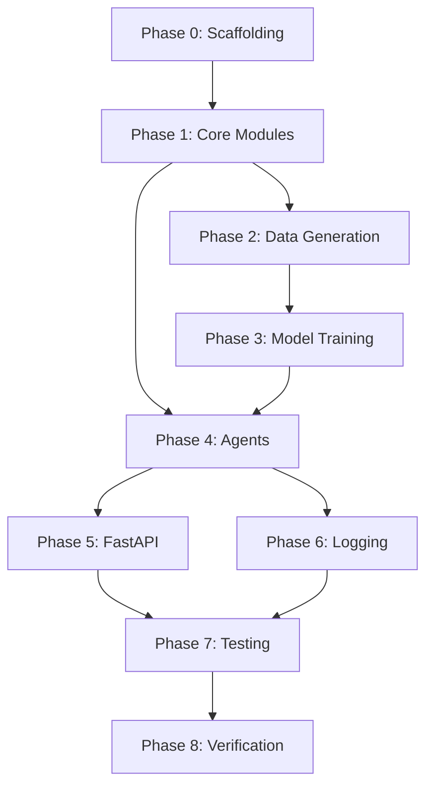

# POC1 — Targeting & Triage Agent
## Step-by-Step Execution Plan

**Owner:** Prasanna · **Status:** Ready to Execute · **Created:** 2026-04-08
**Source:** [POC1_Requirements_v3.md](file:///c:/Projects/algoleap-poc-projects/poc-iqeq-agentmesh/targetingtriage/requirements/POC1_Requirements_v3.md) · [POC1_Prototype_Scope_Contract.md](file:///c:/Projects/algoleap-poc-projects/poc-iqeq-agentmesh/targetingtriage/scope/POC1_Prototype_Scope_Contract.md)

---

## What Are We Building?

An end-to-end **agentic AI pipeline** that identifies high-priority accounts for IQ-EQ's Continental Europe FAM/PIAO business. The system uses:
- **XGBoost** (ML) to score account propensity from historical patterns
- **LLM** to add contextual reasoning and assign priority buckets
- **Deterministic rules** to resolve Next Best Actions
- **Conflict detection** to flag disagreements between ML and LLM

Six agents flow linearly: a user triggers the pipeline → the system scores 50 accounts → returns prioritised recommendations with plain-English rationale.

---

## Build Phases Overview

```
Phase 0: Project Scaffolding .............. Foundation (directories, configs, dependencies)
Phase 1: Shared Core Modules .............. features.py, data_gen.py, constants.py, schemas.py
Phase 2: Data Generation .................. Training data (2,500 accounts) + Runtime data (50 accounts)
Phase 3: Model Training ................... XGBoost + isotonic calibration → pickle
Phase 4: Agent Implementation ............. All 6 agents, one at a time
Phase 5: FastAPI Endpoint .................. POST /score_accounts
Phase 6: Logging & Audit .................. audit.jsonl + governance_queue.jsonl
Phase 7: Testing .......................... Feature parity + golden path + schema validation
Phase 8: Verification & Polish ............ Definition of Done checklist
```

---

# Phase 0: Project Scaffolding
> **Goal:** Create the directory structure, config files, and install dependencies.

## Step 0.1 — Create Directory Structure

Create the exact layout defined in the scope contract:

```
poc1-targeting-triage/
├── app/
│   ├── agents/          ← 5 specialist agents live here
│   ├── __init__.py
│   ├── main.py
│   ├── orchestration_agent.py
│   ├── features.py
│   ├── data_gen.py
│   ├── schemas.py
│   └── constants.py
├── data/
│   ├── training/        ← gitignored, 2,500 accounts
│   └── synthetic/       ← committed, 50 accounts
├── models/              ← pickle + score distribution plot
├── scripts/
│   ├── generate_training_data.py
│   ├── generate_runtime_data.py
│   └── train_xgb.py
├── logs/                ← audit.jsonl, governance_queue.jsonl
├── tests/
│   ├── test_feature_parity.py
│   └── test_golden_path.py
├── requirements.txt
├── .gitignore
└── README.md
```

**Why this layout:** `features.py` and `data_gen.py` being shared between `scripts/` (training) and `app/` (runtime) is the structural backbone that prevents training/serving skew — the most common ML prototype bug.

## Step 0.2 — Create `requirements.txt`

```
fastapi>=0.104.0
uvicorn>=0.24.0
pandas>=2.1.0
numpy>=1.26.0
xgboost>=2.0.0
scikit-learn>=1.3.0
joblib>=1.3.0
pydantic>=2.5.0
matplotlib>=3.8.0
httpx>=0.25.0
pytest>=7.4.0
```

**Explanation:** These are the minimum packages needed. `fastapi` + `uvicorn` for the API, `pandas` + `numpy` for data manipulation, `xgboost` + `scikit-learn` for ML, `joblib` for pickle serialization, `pydantic` for schema validation, `matplotlib` for the score distribution histogram.

## Step 0.3 — Create `.gitignore`

```
data/training/
__pycache__/
*.pyc
.env
logs/
```

**Explanation:** Training data is gitignored because it's regenerable from script. Runtime data (`data/synthetic/`) is committed because it includes hand-engineered demo accounts.

## Step 0.4 — Install Dependencies

```bash
pip install -r requirements.txt
```

---

# Phase 1: Shared Core Modules
> **Goal:** Build the foundational modules that training, data generation, and agents all share. These are the "structural backbone" of the prototype.

## Step 1.1 — Create `app/constants.py`

**What it contains:**
- `ML_HIGH_THRESHOLD = 0.70` — score above this = ML says "High"
- `ML_LOW_THRESHOLD = 0.30` — score below this = ML says "Low"
- `LLM_BUCKET_TO_LEVEL` mapping — converts A/B/C buckets to High/Medium/Low
- `NBA_MAP` — deterministic Next Best Action lookup per bucket
- `FEATURE_ORDER` — the exact column order XGBoost expects (8 features)
- `COUNTRIES` — DE, FR, IT, ES, NL, BE, CH, LU
- `SEGMENTS` — FAM, PIAO

**Why this file matters:** All thresholds and mappings live in one place. If you need to retune `ML_HIGH_THRESHOLD` after inspecting the score distribution, you change it in exactly one location.

## Step 1.2 — Create `app/schemas.py`

**What it contains:** Pydantic models for every I/O boundary in the pipeline.

| Model | Purpose |
|---|---|
| `AccountResult` | Single account output: account_id, priority_bucket, ml_score, confidence_level, conflict_flag, rationale_text, nba_actions |
| `NBAAction` | action_type, description, due_in_days |
| `PipelineResponse` | pipeline_run_id, generated_at, model_version, list of AccountResult |
| `ScoringOutput` | propensity_score + confidence_level per account |
| `ReasoningOutput` | priority_bucket + rationale_text per account |

**Why Pydantic:** The Formatting Agent uses these schemas to enforce that every output field is present and correctly typed. If any agent produces malformed data, the pipeline fails loudly instead of returning garbage.

## Step 1.3 — Create `app/features.py`

**What it contains:** The single `compute_features()` function that converts raw 1:N data into a per-account feature row.

```python
def compute_features(account_id: str, raw: dict) -> dict:
    # 1. Filter each table to this account
    # 2. Aggregate opportunities → win_rate, avg_deal_size_eur, open_opps_count
    # 3. Pull snowflake metrics → service_penetration, growth_metrics_qoq
    # 4. Compute composite engagement_score (usage + conference attendance)
    # 5. Check for recent fund launches → launch_indicator
    # 6. Count tier-1 conferences → tier_1_conf_count
    # Returns: dict with exactly 8 features
```

**The 8 locked features:**

| # | Feature | Source | Description |
|---|---|---|---|
| 1 | win_rate | opportunities | Wins / closed opportunities |
| 2 | avg_deal_size_eur | opportunities | Mean deal size across all opps |
| 3 | open_opps_count | opportunities | Currently open opportunities |
| 4 | service_penetration | snowflake_metrics | Service adoption depth (0–1) |
| 5 | engagement_score | snowflake_metrics + conference_attendance | Composite: base score + 5 per attendance + 10 per high-signal |
| 6 | launch_indicator | external_funds | 1 if fund launched in last 90 days, else 0 |
| 7 | tier_1_conf_count | conferences + conference_attendance | Number of tier-1 conferences attended |
| 8 | growth_metrics_qoq | snowflake_metrics | Period-over-period revenue growth |

**Why this is the most critical file:** This function runs identically during training (`train_xgb.py`) and at runtime (`scoring_agent.py`). If these diverge, the model silently produces garbage. The `test_feature_parity.py` test exists specifically to catch this.

## Step 1.4 — Create `app/data_gen.py`

**What it contains:** Shared generator functions used by both `generate_training_data.py` and `generate_runtime_data.py`.

Functions:
- `generate_accounts(n, seed, id_start)` → accounts DataFrame
- `generate_opportunities(accounts, seed)` → exactly 4 per account
- `generate_snowflake_metrics(accounts, seed)` → 1:1 pre-aggregated
- `generate_external_funds(accounts, seed)` → ~60% coverage
- `generate_conferences(seed)` → ~25 conference catalog
- `generate_conference_attendance(accounts, conferences, seed)` → M:N join, ~2.5 per account

**Why shared:** If training data uses one distribution and runtime uses another, the model will behave unpredictably. Sharing the generator functions guarantees both datasets have the same statistical shape.

---

# Phase 2: Data Generation
> **Goal:** Generate the two datasets: 2,500 labelled training accounts and 50 unlabelled runtime accounts.

## Step 2.1 — Create `scripts/generate_training_data.py`

**What it does:**
1. Calls `data_gen.py` functions with seed=42, n=2500, id_start=1
2. For each opportunity, applies the **hidden label function** to assign `won_deal`:
   ```python
   true_prob = sigmoid(
       1.5 * service_penetration
     + 1.0 * (engagement_score / 100)
     + 0.8 * has_recent_fund_launch
     + 0.6 * tier_1_conf_count_normalized
     + 0.5 * strategic_priority_flag
     - 1.0   # bias for ~35% positive class
   )
   ```
3. Saves all 6 CSVs to `data/training/`

**Why 2,500 accounts:** With 8 features, you need ~200 examples per feature for stable tree splits = 1,600 minimum. 2,500 gives comfortable headroom. AUC plateaus on synthetic data around 2K–3K rows; going larger adds training time with no demo benefit.

**Expected row counts:** accounts=2,500 · opportunities=10,000 · snowflake_metrics=2,500 · external_funds=~1,500 · conferences=~25 · conference_attendance=~6,250

## Step 2.2 — Create `scripts/generate_runtime_data.py`

**What it does:**
1. Calls `data_gen.py` functions with seed=43, n=50, id_start=90001
2. Does NOT add `won_deal` labels (runtime has no labels)
3. **Hand-engineers 17 special accounts:**

| Group | IDs | Purpose |
|---|---|---|
| Golden path | `ACME-EU-90001` | 4 won opps, 5 tier-1 conferences, 2 fund launches → must score Bucket A |
| Engineered conflicts | `ACME-EU-90002` to `90004` | High ML + zero context (or vice versa) → must trigger `conflict_flag=True` |
| Clear Bucket C | `ACME-EU-90005` to `90009` | All lost, no conferences, no funds → trivially Bucket C |
| Borderline | `ACME-EU-90010` to `90017` | Mixed signals near thresholds → tests rationale quality |
| Background | `ACME-EU-90018` to `90050` | Naturally distributed → makes dataset feel real |

4. Saves all 6 CSVs to `data/synthetic/`

**Why 50 accounts:** Legible on screen, demo runs in under 60 seconds, allows hand-engineering while keeping realistic volume.

## Step 2.3 — Run Training Data Generation

```bash
python scripts/generate_training_data.py
```

Validate:
- [ ] 6 CSV files created in `data/training/`
- [ ] Row counts match expected (see table in Step 2.1)
- [ ] No orphaned foreign keys
- [ ] ~35% positive class rate on `won_deal`

## Step 2.4 — Run Runtime Data Generation

```bash
python scripts/generate_runtime_data.py
```

Validate:
- [ ] 6 CSV files created in `data/synthetic/`
- [ ] Golden path `ACME-EU-90001` has expected profile
- [ ] No `won_deal` column in opportunities.csv
- [ ] Conference catalog is identical to training set

---

# Phase 3: Model Training
> **Goal:** Train XGBoost on 2,500 accounts, calibrate probabilities, verify AUC, commit pickle.

## Step 3.1 — Create `scripts/train_xgb.py`

**What it does (in order):**

1. **Load training data** from `data/training/` (all 6 CSVs)
2. **Aggregate features** — call `features.py` → `compute_features()` for each of 2,500 accounts → produces a 2,500 × 8 matrix
3. **Derive account-level label** — `account_won_majority = (win_rate >= 0.5)`
4. **Split** — 70/15/15 stratified on the label, seed 42 → ~1,750 train / ~375 val / ~375 test
5. **Train XGBoost:**
   ```python
   XGBClassifier(
       n_estimators=200,
       max_depth=5,
       learning_rate=0.1,
       random_state=42,
       eval_metric="logloss",
   )
   ```
6. **Calibrate** — `CalibratedClassifierCV(method="isotonic", cv=3)` (XGBoost outputs are over-confident at extremes; the conflict thresholds depend on calibrated probabilities)
7. **Evaluate:**
   - AUC on test set (must be ≥ 0.75, ceiling ~0.85 on synthetic)
   - Confusion matrix at 0.5 threshold
   - Score distribution histogram → `models/score_distribution.png`
8. **Save pickle:**
   ```python
   joblib.dump({
       "model": calibrated_model,
       "feature_names": FEATURE_ORDER,
       "model_version": "xgb_propensity_v1",
       "trained_at": datetime.utcnow().isoformat(),
       "test_auc": auc_score,
       "training_account_count": 2500,
   }, "models/xgb_propensity_v1.pkl")
   ```

## Step 3.2 — Run Training

```bash
python scripts/train_xgb.py
```

Validate:
- [ ] Test AUC ≥ 0.75 printed to console
- [ ] `models/xgb_propensity_v1.pkl` created
- [ ] `models/score_distribution.png` shows reasonable spread (not all clustered at 0 or 1)

## Step 3.3 — Threshold Verification

After training, run the model on the 50 runtime accounts and inspect:
- If scores cluster between 0.4–0.6 → lower `ML_HIGH_THRESHOLD`
- If scores spread well across 0–1 → keep 0.70
- Update `app/constants.py` if threshold changes

**Why this step exists:** The threshold 0.70 is provisional. On synthetic data, calibrated probabilities can behave differently than expected. This is the one manual check before locking the model.

---

# Phase 4: Agent Implementation
> **Goal:** Build all 6 agents, one at a time, following the linear pipeline order.

## Step 4.1 — Orchestration Agent (`app/orchestration_agent.py`)

**What it does:**
1. Receives user intent (for v1: no filters, just trigger the pipeline)
2. Generates a `pipeline_run_id` (UUID4) for tracing
3. Delegates to Data Agent (single outbound delegation)
4. Waits for the pipeline to complete
5. Receives final payload from Formatting Agent
6. Writes start/end audit events to `logs/audit.jsonl`
7. Returns the structured JSON response to the user

**Why it exists as a separate agent:** Even though in v1 it just passes through, the Orchestration Agent is the single entry/exit point. This pattern scales cleanly when you add filters, auth, or multi-POC orchestration in v2.

## Step 4.2 — Data Agent (`app/agents/data_agent.py`)

**What it does:**
1. Loads all 6 CSVs from `data/synthetic/`
2. Validates referential integrity:
   - Every `account_id` in child tables exists in accounts.csv
   - No duplicate primary keys
   - No null FKs
3. Returns a validated multi-table dict: `{"accounts": df, "opportunities": df, ...}`
4. Writes audit event

**Error handling:** Fails loudly if any referential integrity check fails. No silent data issues allowed.

## Step 4.3 — Scoring Agent (`app/agents/scoring_agent.py`)

**What it does:**
1. Receives validated raw dataset from Data Agent
2. Calls `features.py` → `compute_features()` for each account → builds feature matrix
3. Loads pickle from `models/xgb_propensity_v1.pkl`
4. **Asserts** `df.columns.tolist() == pickle["feature_names"]` — fails loudly on mismatch
5. Runs `model.predict_proba()` → emits `propensity_score` (probability of positive class)
6. Emits `confidence_level` (for v1: same as propensity_score or model-derived; flows through unused, reserved for v2)
7. Writes audit event

**Why the column assertion matters:** This is the single most likely place for a silent bug. If someone reorders features in `features.py` but doesn't retrain the model, scores will be garbage but won't error — the assertion catches this.

## Step 4.4 — Reasoning Agent (`app/agents/reasoning_agent.py`)

**What it does:**
1. Receives `propensity_score` + `confidence_level` + business context per account
2. For each account, fills the locked prompt template:
   ```
   You are the Reasoning Agent for IQ-EQ FAM/PIAO account triage.
   Given an account with:
   - propensity_score: {ml_score}
   - confidence_level: {confidence}
   - launch_indicator: {launch}
   - tier_1_conf_count: {tier_1_count}
   - segment: {segment}, country: {country}

   Assign a priority bucket and write a one-sentence rationale.
   Rules:
   - Bucket A: strong commercial signal AND contextual catalyst
   - Bucket B: moderate signal OR mixed context
   - Bucket C: weak signal AND no contextual catalyst
   - Do NOT recalculate the propensity score
   - Rationale must reference at least one specific signal

   Return strict JSON: {"priority_bucket": "A|B|C", "rationale_text": "..."}
   ```
3. Invokes the multi-provider LLM router from `agentic-ai-blueprint`
4. Parses JSON response → emits `priority_bucket` + `rationale_text`
5. Writes audit event

**Critical constraint:** The LLM must NOT recalculate ML scores. It receives structured scores and adds a semantic layer on top. This separation is what makes the system auditable under ISO 42001.

## Step 4.5 — Validation Agent (`app/agents/validation_agent.py`)

**What it does:**
1. Receives all per-account data (ML scores + LLM bucket + context)
2. Applies the conflict detection rule:
   ```python
   def is_conflict(ml_score, llm_bucket):
       ml_level = "High" if ml_score >= 0.70 else "Low" if ml_score <= 0.30 else "Medium"
       llm_level = {"A": "High", "B": "Medium", "C": "Low"}[llm_bucket]
       return (ml_level, llm_level) in {("High", "Low"), ("Low", "High")}
   ```
3. Sets `conflict_flag = True` on any account where ML and LLM disagree
4. Appends flagged accounts to `logs/governance_queue.jsonl`
5. Passes ALL accounts forward (pipeline does NOT block on conflicts)
6. Writes audit event

**Why conflicts are surfaced, never suppressed:** In a real governance setting, hiding disagreements between ML and LLM would be a compliance failure. The Governance Workbench (v2) will let humans review these. For now, JSONL logging is the stub.

## Step 4.6 — Formatting Agent (`app/agents/formatting_agent.py`)

**What it does:**
1. Receives all per-account data (scores + bucket + conflict flag + rationale)
2. Resolves NBA (Next Best Action) per bucket — **deterministic, not LLM:**

   | Bucket | action_type | description | due_in_days |
   |---|---|---|---|
   | A | call | Call this week | 5 |
   | B | send_link | Send targeted product brief | 10 |
   | C | schedule | Schedule quarterly check-in | 90 |

3. Validates every account against the Pydantic `AccountResult` schema
4. Assembles the full `PipelineResponse` JSON (pipeline_run_id, generated_at, model_version, accounts array)
5. **Rejects** any payload with missing required fields or invalid types
6. Returns to Orchestration Agent
7. Writes audit event

**Why NBA is rule-based:** ISO 42001 requires every action to be traceable to a rule. LLM-generated actions would be non-deterministic and unauditable.

---

# Phase 5: FastAPI Endpoint
> **Goal:** Wire up the single API endpoint that triggers the full pipeline.

## Step 5.1 — Create `app/main.py`

**What it contains:**
1. FastAPI app initialization
2. `POST /score_accounts` endpoint that calls the Orchestration Agent
3. Returns the `PipelineResponse` JSON

```python
from fastapi import FastAPI
from app.orchestration_agent import run_pipeline

app = FastAPI(title="POC1 - Targeting & Triage Agent")

@app.post("/score_accounts")
async def score_accounts():
    result = await run_pipeline()
    return result
```

**Why single endpoint:** The scope contract explicitly locks the API surface to one endpoint. `GET /account_view/{id}` and `POST /prioritize_accounts` are v2 features.

## Step 5.2 — Test the Endpoint

```bash
# Start server
uvicorn app.main:app --reload --port 8000

# Trigger pipeline
curl -X POST http://localhost:8000/score_accounts
```

Or visit `http://localhost:8000/docs` for Swagger UI.

---

# Phase 6: Logging & Audit
> **Goal:** Implement the two JSONL log files for audit trail and governance.

## Step 6.1 — Audit Log (`logs/audit.jsonl`)

Each agent writes one line per invocation:
```json
{"run_id": "uuid", "agent": "data_agent", "input_hash": "sha256", "output_hash": "sha256", "ts": "ISO8601", "duration_ms": 42}
```

**Why input/output hashes:** This creates an immutable chain — you can verify that each agent received exactly what the previous agent produced, without storing full payloads.

## Step 6.2 — Governance Queue (`logs/governance_queue.jsonl`)

The Validation Agent appends one line per conflicting account:
```json
{"run_id": "uuid", "account_id": "ACME-EU-90003", "ml_score": 0.82, "llm_bucket": "C", "conflict_flag": true, "ts": "ISO8601"}
```

**Why a separate file:** In v2, the Governance Workbench UI will read this file. Keeping it separate from the audit log makes it easy to build the review interface later.

---

# Phase 7: Testing
> **Goal:** Write and run the two critical test files.

## Step 7.1 — Create `tests/test_feature_parity.py`

**What it tests:**
- `compute_features()` produces identical output for the same input across multiple runs
- Feature count is exactly 8
- Feature names match `FEATURE_ORDER` from constants.py
- No NaN values in output
- Works correctly on both training and runtime data

**Why this test exists:** Training/serving skew is the #1 silent failure in ML pipelines. This test catches it.

## Step 7.2 — Create `tests/test_golden_path.py`

**What it tests:**
- `ACME-EU-90001` runs through the full pipeline end-to-end
- Returns `priority_bucket = "A"`
- Returns a non-empty `rationale_text`
- `conflict_flag = false` (golden path should not conflict)
- NBA action is `{call, "Call this week", 5}`
- All required output fields are present

**Why this test exists:** If the golden path account doesn't produce Bucket A, something fundamental is broken in the data engineering or model.

## Step 7.3 — Run Tests

```bash
pytest tests/ -v
```

---

# Phase 8: Verification & Polish
> **Goal:** Walk through the full Definition of Done checklist and create the README.

## Step 8.1 — Definition of Done Checklist

| # | Criterion | How to Verify |
|---|---|---|
| 1 | `train_xgb.py` produces calibrated pickle with AUC ≥ 0.75 | Check console output |
| 2 | `score_distribution.png` is sane | Visual inspection — scores spread across 0–1 |
| 3 | `ML_HIGH_THRESHOLD` retuned if needed | Inspect runtime score distribution |
| 4 | `test_feature_parity.py` passes | `pytest tests/test_feature_parity.py` |
| 5 | Feature aggregation: 2,500 train / 50 runtime rows, zero orphans | Check script output |
| 6 | `POST /score_accounts` returns valid JSON | `curl -X POST localhost:8000/score_accounts` |
| 7 | At least 2/3 engineered conflict accounts have `conflict_flag=True` | Check response JSON |
| 8 | `ACME-EU-90001` returns Bucket A with coherent rationale | Check response JSON |
| 9 | `logs/audit.jsonl` has one entry per agent per run (6 entries) | `cat logs/audit.jsonl` |
| 10 | `logs/governance_queue.jsonl` has flagged accounts | `cat logs/governance_queue.jsonl` |
| 11 | Pydantic rejects malformed payloads | One negative test |
| 12 | README has one-command run instruction | Read README.md |

## Step 8.2 — Create `README.md`

Include:
1. **What this is** — one-paragraph description
2. **Quick Start** — `pip install -r requirements.txt` → `uvicorn app.main:app`
3. **Full Setup** — data generation → training → running
4. **Architecture** — pipeline flow diagram
5. **Demo Walkthrough** — talk track for the golden path account
6. **Out of Scope** — explicit list from scope contract

---

## Execution Order Summary

```
Phase 0  →  Scaffolding              (30 min)
Phase 1  →  Core modules             (2-3 hrs)   ← Most critical: features.py + schemas.py
Phase 2  →  Data generation          (2-3 hrs)   ← Depends on Phase 1 (data_gen.py, features.py)
Phase 3  →  Model training           (1-2 hrs)   ← Depends on Phase 2 (training data)
Phase 4  →  Agent implementation     (3-4 hrs)   ← Depends on Phases 1 + 3 (schemas, pickle)
Phase 5  →  FastAPI endpoint         (30 min)    ← Depends on Phase 4 (orchestration agent)
Phase 6  →  Logging & audit          (1 hr)      ← Can be woven into Phase 4
Phase 7  →  Testing                  (1-2 hrs)   ← Depends on everything above
Phase 8  →  Verification & polish    (1 hr)      ← Final pass
─────────────────────────────────────────────────
Total estimated:                     ~12-16 hrs
```

---

## Dependency Graph



---

## What Is Explicitly Out of Scope

> Say this in the demo.

- Governance Workbench UI
- Override workflow
- Real Snowflake/CRM connectors
- IQEQ.AI internal LLM tenant
- Copilot UX layer
- Auth / RBAC
- Persistence
- Retraining loop
- Multi-POC orchestration
- Production error handling
- Latency/scale targets
