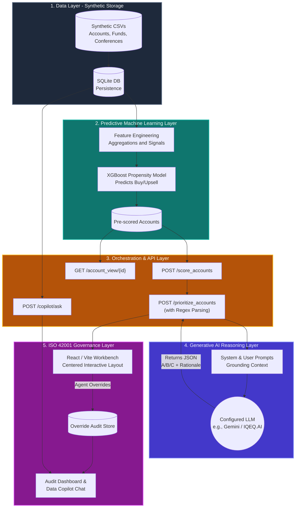

# IQ-EQ Targeting & Triage Agent: Architecture Overview

**Target Audience:** Executive Management & Steering Committee
**Author:** AI Architecture Team

This document outlines the architectural design of the Targeting & Triage Agent Proof of Concept (POC) for the FAM/PIAO Continental Europe business. It is designed to demonstrate how we integrate predictive analytics (Machine Learning) with generative AI (Large Language Models), wrapped in an enterprise-grade governance framework.

---

## 1. High-Level Architecture Diagram

The system is designed as a modular, 5-layer architecture. This separation of concerns allows us to iterate rapidly on the AI components without disrupting the core data pipelines or governance controls.

---

## 2. Architectural Layer Breakdown

### Layer 1: Data Engine (The Foundation)
**Component:** SQLite / Pandas
**What it does:** In this POC, we use a synthetic dataset covering accounts, opportunities, Snowflake metrics, and external funds. This completely eliminates data privacy risks ("toxic data") while proving the engineering pipeline. 
**Production Path:** In production, this layer will connect directly to our Snowflake data warehouse and CRM (Salesforce/Dynamics) via secure connectors.

### Layer 2: Predictive Machine Learning (The "Math")
**Component:** XGBoost / Scikit-Learn
**What it does:** Uses historical win/loss data and behavioral signals (like conference attendance and whitespace gaps) to calculate a raw "Propensity to Buy" score. 
**Why it matters:** LLMs are excellent at reasoning, but poor at large-scale statistical calculations. We use deterministic ML to crunch the numbers first, saving significant LLM token costs and improving accuracy.

### Layer 3: API Orchestration (The "Traffic Cop")
**Component:** Python / FastAPI
**What it does:** Serves as the middleman between the data, the AI, and the user interface. It filters the scored accounts based on user requests (e.g., "Show me top prospects in Luxembourg") and prepares the data for the LLM.

### Layer 4: Generative AI Reasoning (The "Brain")
**Component:** Gemini API (External for POC)
**What it does:** Takes the filtered, highly-structured mathematical output from Layer 2 and performs *semantic reasoning*. It reads the scores, looks at the business flags (e.g., upcoming fund launches), and outputs a simple priority bucket. To prevent LLM hallucination crashes, we wrap this layer in strict Regex-based JSON extraction, ensuring the execution never fails due to conversational anomalies.
**Production Path:** The POC uses an external LLM. For production, we will swap this out for our internal, firewall-protected **IQEQ.AI** environment to ensure zero data leakage.

### Layer 5: ISO 42001 Governance (The "Safety Net")
**Component:** React SPA / Audit Endpoints
**What it does:** A "Human-in-the-loop" workbench where Sales Operations can review the AI's recommendations. If a human disagrees with the AI, they *must* categorize the failure (e.g., "Hallucination," "Policy Misalignment," "Data Latency").
**Why it matters:** This establishes the auditable feedback loop required by our ISO 42001 AI Management System certification. We don't just trust the AI; we track its failure rates to continuously improve the underlying prompts and models.

---

## 3. The "4B" Strategy: Bridging to Production

As an AI Architecture team, we follow the "Build, Borrow, Buy, Bridge" methodology. This POC successfully demonstrates the **Bridge**.

1. **Borrow:** We borrowed foundational models (XGBoost, Gemini) rather than building from scratch.
2. **Build:** We built the proprietary "Secret Sauce" — the specific feature engineering (Layer 2) and the strict operational prompts (Layer 4) tailored specifically for FAM/PIAO.
3. **Bridge (Next Steps):** To move this from POC to Production, we will execute the bridging strategy:
   - **Data Swap:** Replace synthetic CSVs with live Snowflake views.
   - **Model Swap:** Move LLM calls behind the firewall to the IQEQ.AI tenant.
   - **Integration:** Embed the React UI directly into the CRM, rather than hosting it as a standalone application.

## 4. Key Takeaways for Management

- **Cost-Efficient Intelligence:** By using cheap, classical ML to do the heavy lifting of scoring, we only invoke the more expensive Generative AI to summarize the top candidates, drastically reducing API costs compared to an "LLM-only" approach.
- **Explainability:** Sales teams won't adopt black-box numbers. The LLM translates the math into a plain-English rationale (e.g., *"Priority A: High propensity driven by a strong historical win rate and an upcoming fund launch in Q3 where we lack middle-office coverage."*)
- **Compliance by Design:** The ISO 42001 workbench guarantees that humans remain accountable for final business decisions, with a full forensic audit trail of all AI overrides.
