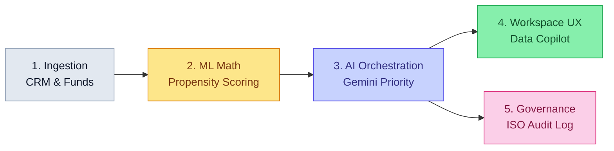

# IQ-EQ Targeting & Triage Agent: Business Flow & Value Proposition

**Target Audience:** Business Stakeholders & Head of Sales
**Objective:** Explain how our AI solution translates raw data into immediate sales action across four core pillars, without technical jargon.

---

## The Core Business Problem
Right now, our sales and relationship managers are overwhelmed with datasets. They have CRM records, fund launch announcements, historical win rates, and conference attendance logs. When a sales rep sits down on Monday morning, they spend hours manually piecing this together just to figure out *who* to call first. This delays action, misses hidden opportunities, and limits our capacity.

## The AI Solution: The 4-Pillar Pipeline
We’ve built an AI assistant that does this groundwork instantly. It acts like an ultra-fast, strategic analyst that works 24/7. Here is the exact flow of how it works:

### 1. Ingestion (The Foundation)
Before any AI can happen, the system must automatically gather the raw facts. Our pipeline securely *ingests* massive amounts of scattered data—from CRM records to specific market indicators like upcoming external fund launches. 
* *Value to Sales:* Reps no longer need to hunt across three different systems to find out basic information about an account.

### 2. Propensity to Buy (The Math)
Next, we run this data through predictive math (Machine Learning). The system calculates a strict, objective **"Propensity to Buy"** score for every single client and prospect. It looks at historical trends like:
* "Have they attended our recent conferences?"
* "What is our historical win rate with them?"
* "What is their service penetration?"

* *Value to Sales:* We eliminate the guesswork and gut-feelings. The math tells us who is objectively most likely to buy right now.

### 3. Orchestration & Governance (The Brain)
Numbers alone aren't enough—salespeople need *context* and *safety*. The central orchestrator takes the top mathematical scores and hands them over to a Generative AI. We give this AI a specific job: act like a seasoned Sales Director to categorize these accounts into **Priority A, B, or C** and write a plain-English rationale explaining *why*.

Crucially, this orchestration layer manages the **Governance Workbench**. If an AI makes a suggestion the human disagrees with, the human can override it. The orchestrator records exactly *why* the human disagreed into a compliance dashboard, ensuring we meet strict ISO 42001 AI safety standard requirements.
* *Value to Sales:* Humans remain the ultimate authority, and our AI remains safe and regulated.

### 4. Output through Copilot & Seamless UX (The Execution)
Rather than trapping all this valuable intelligence inside a static Excel spreadsheet or complex dashboard, the final layer is conversational and fluid. 

The orchestrator feeds the prioritized accounts into our embedded **Data Copilot**. Sales teams receive the output interactively—they can simply open a chat window and ask, *"Which accounts in Luxembourg have an upcoming launch?"*.
Furthermore, the user interface enforces **State Preservation**—meaning users can rapidly switch between the Prioritisation Grid, the Audit Dashboard, and the Copilot without losing their place, creating a truly unified workspace.
* *Value to Sales:* Instant, point-and-shoot execution without needing to filter spreadsheets, and zero frustration when multitasking.

---

## Summary for the Sales Head

*"We are using AI to transform how our sales team structures their week. By combining strict data **Ingestion** and mathematical **Propensity to Buy** scoring, we ground our AI in reality. Our central **Orchestration** ensures the Generative AI is building safe, human-governed action plans, which we then deliver straight to the sales reps via conversational **Output through Copilot**. We instantly point our team toward the exact accounts ready to buy, complete with the context of exactly why they should call them."*
