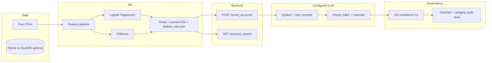

# Targeting & Triage Agent — Implementation Document

**Purpose:** Translate [TriagePlan.md](./TriagePlan.md) (execution plan, milestones, acceptance) and [TriagePOC.md](./TriagePOC.md) (schemas, APIs, ML, governance) into a single build specification for engineering.

**Version:** 1.0 | **Status:** Active | **Data:** Synthetic only (LU, NL, FR, IT — FAM/PIAO)

---

## 1. Scope and success criteria

| Goal | Implementation implication |
|------|----------------------------|
| ~150 accounts, ~800 opportunities | Five CSVs loaded and FK-validated; scoring covers 100% of accounts in scope filters |
| Rank accounts; Priority A/B/C | ML scores + optional LLM bucket/rationale; workbench may override with audit |
| AUC ≥ 0.75 | Train/test split, `roc_auc_score` logged; persist evaluation report with artifacts |
| p95 API < 2s | Precomputed `scored_accounts.csv` at startup or cached inference; avoid per-request full retrains |
| ISO 42001-aligned overrides | Structured UI: forced failure category + persistence for dashboard |
| External LLM for POC | API keys via environment only; production path documented as IQEQ.AI bridge |

---

## 2. System architecture (implementation view)

**POC default stack (Algoleap):** Python (pandas, scikit-learn, XGBoost), FastAPI + uvicorn, CORS enabled, React + Vite + Tailwind for the workbench UI.

---

## 3. Phase-to-implementation mapping

### Phase 1 — Data

| Plan task | Implementation |
|-----------|----------------|
| Generate synthetic CSVs | Run configured LLM with master prompt in TriagePOC §2; or `data/scripts/generate_synthetic_data.py` if used |
| Validate referential integrity | Script or notebook checks: `opportunities.account_id`, `snowflake_metrics.account_id` ⊆ `accounts.account_id`; conference IDs consistent |
| Load into SQLite/DuckDB | Optional: load same files for SQL exploration; **scoring path may stay pandas + CSV** for speed |

**Deliverable:** `accounts.csv`, `opportunities.csv`, `snowflake_metrics.csv`, `external_funds.csv`, `conferences.csv` under a single directory (e.g. `data/synthetic_data/` or `./synthetic_data/` per training script).

### Phase 2 — Features and ML

| Plan task | Implementation |
|-----------|----------------|
| Feature matrix | Per-account aggregates per TriagePOC §6.1: historic win rate, avg deal size, revenue concentration (`current_aum_with_iqeq / total_fund_aum`), upcoming launch flag (vs **POC “today”** date), max conference engagement, plus Snowflake flags and account-level fields |
| Train LR + XGBoost | `LogisticRegression` (L2 + `StandardScaler` pipeline) and `XGBClassifier` (e.g. `max_depth=4`, `n_estimators=200`, `learning_rate=0.05`) |
| Evaluate AUC | Compare models; select primary for production scoring; save metrics to a small report (markdown or JSON) |
| Artifacts | Best model pickle; `feature_cols.json`; optional `scored_accounts.csv` with propensity, `ICP_fit_score`, `whitespace_flag`, `upcoming_launch_flag`, `priority_bucket` (rule-based if LLM not yet applied) |

**Label definition (implement explicitly in code):** e.g. positive class = “won or expansion-like outcome” derived from opportunities (align with training script docstring). Document the exact rule in the training module so SMEs can review.

### Phase 3 — Scoring API

| Requirement (TriagePOC §5.2) | Implementation detail |
|------------------------------|----------------------|
| `POST /score_accounts` | Request body: optional filters — `countries`, `segments`, `status_filter`, `min_propensity`, `limit`. Response: array of objects matching POC example (account identifiers, `ICP_fit_score`, `buy_upsell_propensity`, `whitespace_flag`, `upcoming_launch_flag`, `features` dict) |
| `GET /account_view/{account_id}` | Full single-account payload including features and display fields (`key_contact`, dates, etc.) |
| Integration testing | pytest or manual curl suite; assert schema and filter behaviour; health check endpoint for deploys |

**Cross-cutting:** FastAPI app with CORS; no secrets in repo; configurable paths for `DATA_DIR` / `MODEL_DIR` via env if needed.

**Reference implementation in repo:** `data/scripts/scoring_api.py` (adjust paths to match chosen data layout).

### Phase 4 — LLM orchestration

| Task | Implementation |
|------|----------------|
| Prompt design | Version-controlled markdown/JSON: system message (do not recompute scores; use API values) + user template with JSON payload |
| Orchestration | Configured LLM or thin Python client: call `POST /score_accounts`, pass JSON to model, parse structured output (`account_id`, `priority_bucket`, `rationale_text`) |
| Chaining (mitigation) | For large payloads, batch by country or chunk accounts with multiple LLM calls; merge results deterministically |
| Quality gate | SME spot-check sample; target ≥ 80% satisfaction per plan |

### Phase 5 — ISO workbench UI + audit

| TriagePOC §5.4 | Implementation |
|----------------|----------------|
| Override priority / rationale | Form: select account, show AI suggestion, editable structured fields (dropdown priority, rationale text area with length limits) |
| Forced categorisation on save | Dropdown: **Policy Misalignment**, **Hallucination**, **Data Latency** (required if override differs from model output) |
| Dashboard mapping | Backend table or JSONL: `timestamp`, `user`, `account_id`, `field_changed`, `old_value`, `new_value`, `failure_category` — export or simple admin view |
| Audit completeness | 100% of overrides logged (acceptance criterion) |

**Optional POC extensions (TriagePOC §7):** CSV export of prioritised list; simple “rule weight” simulation for top-N (parameterised re-rank without full retrain).

### Phase 6 — UAT and handover

| Deliverable | Implementation |
|-------------|----------------|
| UAT script | Scenarios: NL+LU list, single-account explanation, high-potential prospects with launch + no middle office |
| Handover package | README: how to regenerate data, train, run API, run UI, env vars; architecture diagram; pointer to bridging doc |

---

## 4. API contracts (normative summary)

### `POST /score_accounts`

- **Input (JSON):** filters as above; defaults should return a bounded list (e.g. `limit` 50).
- **Output:** List of account score objects. Minimum fields per POC example: `account_id`, `name`, `country`, `segment`, `ICP_fit_score`, `buy_upsell_propensity`, `whitespace_flag`, `upcoming_launch_flag`, `features` (numeric snapshot for LLM grounding).

### `GET /account_view/{account_id}`

- **Output:** 404 if unknown; else extended record including `features` and CRM-oriented metadata.

Whitespace and launch flags must be **computed in the ML/feature layer** (or deterministic rules documented alongside the model) so the LLM does not invent them.

---

## 5. Feature engineering checklist (TriagePOC §6.1)

| Feature | Source tables | Notes |
|---------|---------------|--------|
| Historic win rate | opportunities | Closed = Won + Lost; handle zero closed |
| Average deal size | opportunities | Mean `deal_size_eur` |
| Revenue concentration | snowflake_metrics | Ratio; cap or clip outliers if needed |
| Upcoming launch flag | external_funds (+ link to accounts via manager/name or documented join) | Compare `next_launch_date` to scoring `TODAY` |
| Conference engagement | accounts + conferences | Parse `accounts_present`; max `engagement_score` |
| Service / ESG flags | snowflake_metrics, accounts | As per POC |

---

## 6. Security and configuration

- **API keys:** `os.getenv` / `.env` (never commit `.env`).
- **POC LLM:** External API acceptable on synthetic data only; log retention policy documented for demo.
- **Production bridge (TriagePOC §5.5):** Replace external LLM HTTP calls with IQEQ.AI endpoints; split long system prompts into chained prompts; keep `POST /score_accounts` contract stable so the UI and tooling need minimal changes.

---

## 7. Acceptance tests (traceability)

| Plan criterion | How to verify |
|----------------|---------------|
| Model AUC ≥ 0.75 | Printed or saved metric from training script on holdout set |
| Ranking completeness 100% | All accounts in DB appear in full export when no filter; or document intentional exclusions |
| API p95 < 2s | Load test or repeated curl with timing; ensure scoring is I/O bound on precomputed data |
| LLM SME ≥ 80% | UAT checklist with scoresheet |
| Override logging 100% | Integration test: every PATCH/POST override persists row with category |
| FK integrity 0 errors | Validation script exit code 0 |

---

## 8. Repository layout (recommended)

| Path | Role |
|------|------|
| `data/synthetic_data/*.csv` | Source CSVs |
| `data/scripts/generate_synthetic_data.py` | Optional generator |
| `data/scripts/train_propensity_model.py` | Features + train + artifacts |
| `data/scripts/scoring_api.py` | FastAPI app (or promote to root `app.py` for single entrypoint) |
| `frontend/` (or `ui/`) | React ISO workbench |
| `documents/` | Plan, POC, this implementation doc, LLM prompts |

---

## 9. Risks (implementation-focused)

| Risk | Mitigation in build |
|------|---------------------|
| Synthetic data drift | Version CSVs + seed; re-run integrity script in CI or pre-commit |
| LLM hallucination | Ground with fixed `features` JSON; forbid score recalculation in system prompt |
| Rate limits | Batch scoring requests; cache LLM responses by payload hash for demo |
| Context limits | Chunked prioritisation prompts; summarise long lists |

---

## 10. Document control

| Document | Role |
|----------|------|
| [TriagePlan.md](./TriagePlan.md) | Schedule, milestones, deliverables, high-level architecture |
| [TriagePOC.md](./TriagePOC.md) | Schemas, prompts, API examples, governance rules, ML detail |
| **TriageImplementation.md** (this file) | Executable build spec and traceability to acceptance criteria |

---

*Prepared for IQ-EQ FAM/PIAO Continental Europe targeting & triage POC — synthetic data only.*
