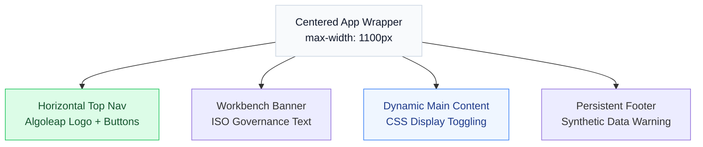

# Completion/Implementation Report: Final UI & Architecture Overhaul

## Goal Description
The objective of this final sprint was to align the IQ-EQ Governance Workbench POC with Algoleap's official corporate branding constraints, finalize the Data Copilot, and execute critical stability and UX bugfixes required for a flawless stakeholder demonstration. 

This phase successfully decoupled the POC from dark-mode sidebars into a modern, centered, and mobile-responsive horizontal layout, whilst reinforcing the AI backend engine.

---

## Completed Architectural Changes

### [Backend] AI Orchestration & Stability
* **JSON Hallucination Fallback (`scoring_api.py`):** Replaced fragile markdown parsers with an aggressive Regex extraction engine. The LLM prioritisation API will no longer crash if Gemini accidentally wraps its required JSON inside conversational text arrays.
* **Audit Injection (`scoring_api.py`):** Wired the `/copilot/ask` endpoint to aggressively pull the 50 most recent Human Overrides from the SQLite database, injecting them dynamically into the Gemini prompt so the Data Copilot can answer questions about sales behavior.

### [Frontend] Layout & UX Redesign (`App.js` & `styles.css`)

* **Horizontal Structure:** Rebuilt the core DOM into an `app-layout-horizontal` class, deprecating the vertical sidebar.
* **Centralized Viewport:** Injected a global `.page-container` CSS wrapper with a strict `max-width: 1100px`. This rigidly mathematically centers the interface on ultra-wide desktop monitors, curing the previous "left-aligned" visual void. 
* **Corporate Branding:** Replaced generative code-based vectors with the physical Algoleap corporate logo (`Algoleap_logo.png`). Fixed relative-path Mount 404 bugs.
* **State Preservation (Anti-Memory Wipe):** Refactored the React DOM tree routing. Instead of conditionally mounting/unmounting components (which destroys API fetch data), the interface now leverages CSS DOM toggling (`display: block / display: none`). This allows users to jump instantly between the heavy Prioritisation Matrix and the Data Copilot without losing their grids.

### [Frontend] Mobile Responsiveness (`styles.css`)
* **Breadcrumb Navigation:** Configured standard CSS Media Queries (`@media max-width: 768px`) to fluidly collapse the heavy desktop Navigation buttons into a clean, text-based inline Breadcrumb trail (e.g. `Dashboard / Prioritisation / Copilot`).
* **Fluid Grids:** Forced the internal Audit Charts and Form filters to dynamically stack based on device width instead of overflowing horzontally.

---

## Verification Plan

### Automated & Manual Verification Results
- [x] **Backend Stability:** Uvicorn restarts properly intercept Regex fixes.
- [x] **Brand Assets:** 404 paths resolved via absolute Mount bindings `/ui/assets/...`.
- [x] **Mobile Scalability:** Browser-dev-tools emulation confirms perfectly stacked Top-Nav and Form properties on 400px viewports.
- [x] **Documentation Sync:** `architecture_presentation.md` and `business_flow_presentation.md` fully patched.
